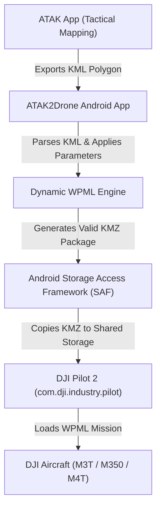

# DJI SDK & Ecosystem Technical Reference

This document serves as the authoritative reference for DJI SDK repositories, WPML flight planning components, and enterprise drone/payload enumerations relevant to **ATAK2Drone**.

---

## 1. Overview of DJI SDK Ecosystem (`https://github.com/dji-sdk`)

The official [DJI GitHub Organization](https://github.com/dji-sdk) hosts open-source SDKs, sample code, and API specifications for enterprise drone automation.

| Repository | Description & Relevance to ATAK2Drone |
|---|---|
| [`Mobile-SDK-Android-V5`](https://github.com/dji-sdk/Mobile-SDK-Android-V5) | Primary Android SDK (V5) supporting Enterprise drones (M350 RTK, M300 RTK, Mavic 3 Enterprise/Thermal, M30/M30T, Matrice 3D/3TD). Contains Waypoint V3 manager APIs (`IWPMZManager`) and validation routines. |
| [`Cloud-API`](https://github.com/dji-sdk/Cloud-API) | Specifications for DJI Cloud API, including WPML (Waypoint Markup Language) XML schemas, execution protocols, and ground-station integration. |
| [`Mobile-SDK-Android`](https://github.com/dji-sdk/Mobile-SDK-Android) | Legacy MSDK V4 (Waypoint V1/V2) used for older consumer/enterprise aircraft (Matrice 200, Phantom 4 RTK, Mavic 2 Enterprise). |
| [`UXSDK-Android`](https://github.com/dji-sdk/UXSDK-Android) | Reusable UI components for video streaming, map widgets, and telemetry displays. |
| [`Payload-SDK`](https://github.com/dji-sdk/Payload-SDK) | C/C++ SDK for third-party payload developers integrating custom cameras, sensors, or drop mechanisms. |

---

## 2. Waypoint Mission Architecture in MSDK V5

In MSDK V5, traditional Waypoint V1/V2 programmatic step missions are replaced by **Waypoint V3**, which uses standard **WPML `.kmz` packages**.

### Core Interfaces in MSDK V5
- **`IWPMZManager`**: Manages reading, writing, validating, uploading, and executing WPML `.kmz` files.
  - `checkValidation(kmzFilePath)`: Pre-flight validation verifying file integrity, waypoint coordinate bounds, turn mode consistency, and camera action compatibility.
  - `pushKMZFileToAircraft()`: Uploads the mission file directly to the aircraft/remote controller storage.
- **`WayPointV3Fragment.kt`**: Reference UI and controller sample in `Mobile-SDK-Android-V5` illustrating how mission files are selected, validated, and transferred.

---

## 3. Aircraft & Payload Enumeration Mapping (`wpmz/template.kml`)

DJI WPML requires explicit aircraft (`droneEnumValue`) and payload (`payloadEnumValue`) identifiers inside `template.kml`. Setting invalid or mismatched values will cause DJI Pilot 2 or MSDK V5 to reject the mission package upon import.

> [!IMPORTANT]
> Official MSDK V5 documentation and the [DJI Developer Portal](https://developer.dji.com/) serve as the source of truth for all enumeration values.

### Enumeration Table

| Aircraft Series | `resValue` / Flavor | `wpml:droneEnumValue` | `wpml:droneSubEnumValue` | `wpml:payloadEnumValue` | Target Payloads / Cameras |
|---|---|---|---|---|---|
| **Mavic 3 Thermal** | `mavic3t` | `77` | N/A | `67` | M3T Thermal + Wide/Zoom Gimbal |
| **Mavic 3 Enterprise** | `mavic3e` | `77` | N/A | `66` | M3E Wide/Zoom Visual Gimbal |
| **Matrice 300 RTK** | `matrice300m350` | `60` | N/A | `42` / `43` / `150` | Zenmuse H20 (`42`), H20T (`43`), P1 (`150`), L1 (`160`) |
| **Matrice 350 RTK** | `matrice300m350` | `89` | N/A | `42` / `43` / `61` / `62` | Zenmuse H20/H20T, H30 (`61`), H30T (`62`), L2 (`160`) |
| **Matrice 30 / 30T** | `matrice30` | `67` | `0` (M30) / `1` (M30T) | `52` (M30) / `53` (M30T) | Integrated M30/M30T Gimbal Camera |
| **Mavic 4 Enterprise / Thermal** | `m4t` | `1001` *(SDK fallback)* | N/A | `1000` *(SDK fallback)* | M4T Multi-Sensor Enterprise Payload |

> [!NOTE]
> `droneSubEnumValue` is strictly required when `droneEnumValue` is `67` (Matrice 30 series). `payloadPositionIndex` specifies payload placement: `0` (Main Gimbal / Single Payload), `1` (Secondary Gimbal), `2` (Top Gimbal).

---

## 4. ATAK2Drone Integration Architecture

ATAK2Drone operates as an **offline mission package generator**:

### Advantages of Offline WPML Generation
1. **Zero Runtime Dependency Overhead**: Avoids bundling bulky MSDK native libraries (`.so` binaries) into the ATAK2Drone APK.
2. **Simplified Permissions**: No aircraft connection, location, or USB runtime permissions required.
3. **Seamless DJ Pilot 2 Handoff**: DJI Pilot 2 handles real-time flight controls, obstacle avoidance, return-to-home, and fail-safes natively while reading ATAK2Drone-generated `.kmz` packages.
