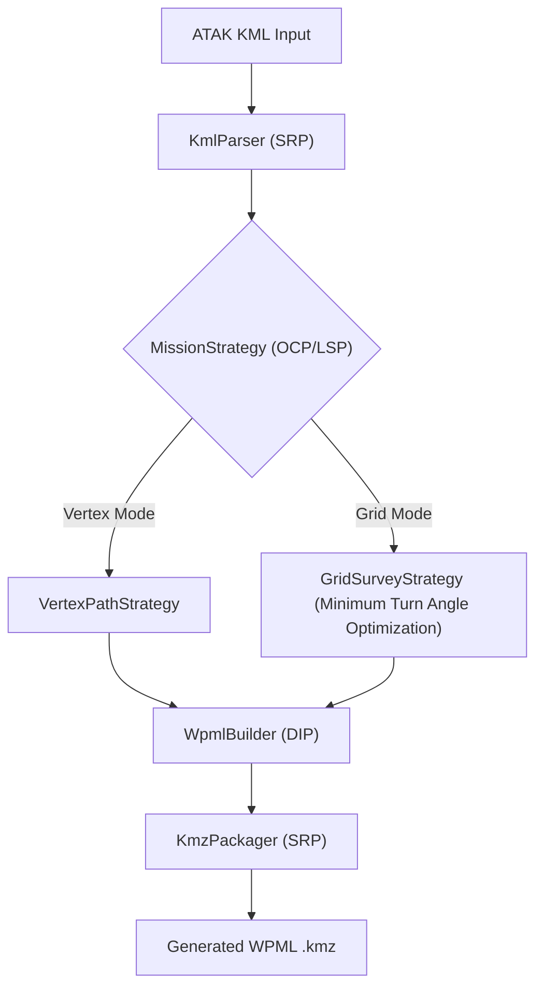
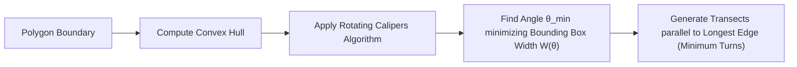

# ATAK2Drone Optimization Roadmap & Architecture Blueprint

This document outlines the architectural enhancements, algorithmic design for optimal grid flight planning, and SOLID refactoring roadmap for **ATAK2Drone**.

---

## 1. Core Architectural Refactoring (SOLID Principles)

The current implementation relies on mutating static XML template files in `WpmlGenerator.kt`. To maximize maintainability, scalability, and code clarity, we decouple core capabilities into specialized modules adhering to **SOLID principles**.

### SOLID Breakdown
1. **Single Responsibility Principle (SRP)**:
   - `KmlParser`: Strictly parses input KML files into structured polygon vertices.
   - `WpmlBuilder`: Constructs clean WPML `template.kml` and `waylines.wpml` XML structures in memory.
   - `SurveyGridGenerator`: Computes grid transects and turn points.
   - `KmzPackager`: Handles ZIP compression and SAF destination writing.
2. **Open/Closed Principle (OCP)**:
   - `MissionGeneratorStrategy` interface allows adding new path planning patterns (e.g., Corridor Survey, Circle/Point-of-Interest, Multi-Grid) without modifying existing path generation logic.
3. **Liskov Substitution Principle (LSP)**:
   - All path strategies output standard `List<Coordinate>` and `List<ActionGroup>` structures that can be seamlessly processed by `WpmlBuilder`.
4. **Interface Segregation Principle (ISP)**:
   - Fine-grained interfaces (`IKmlParser`, `IWpmlGenerator`, `IKmzExporter`) prevent components from depending on unused methods.
5. **Dependency Inversion Principle (DIP)**:
   - High-level controllers depend on abstractions (`MissionGeneratorStrategy`), injected via constructors or factory methods.

---

## 2. Altitude Selection & Parameterization Scheme

### Current Implementation
ATAK2Drone provides `200ft` and `400ft` radio buttons in the UI, selecting one of 6 bundled KMZ template files.

### Proposed Parameterization Scheme
- **Preserve Quick-Select Presets**: Retain `200 ft` and `400 ft` as primary quick-select preset options in the UI for ease of operational deployment.
- **Add Custom Free-Type Altitude Field**: Introduce an optional custom altitude entry field allowing operators to input any custom altitude (e.g., 50 ft to 400 ft / 15 m to 120 m).
- **Unified Dynamic WPML Generation**: Whether a preset (`200ft`, `400ft`) or a custom free-type altitude is chosen, the dynamic WPML generator converts the specified altitude to meters and injects it directly into `<wpml:executeHeight>` and related height tags during XML building.

---

## 3. Lawnmower / Grid Survey Generation & Minimum Flight Duration Angle Optimization

In addition to boundary vertex pathing, ATAK2Drone will generate automated grid survey coverage patterns inside the ATAK polygon.

### 3.1 Mission Duration Formulation

Total mission execution time $T(\theta)$ as a function of grid orientation angle $\theta \in [0^\circ, 180^\circ)$:

$$T(\theta) = \frac{L_{\text{transect}}(\theta)}{v_{\text{flight}}} + \frac{N_{\text{turns}}(\theta) \cdot d_{\text{spacing}}}{v_{\text{turn}}} + N_{\text{turns}}(\theta) \cdot \tau_{\text{turn}}$$

Where:
- $L_{\text{transect}}(\theta)$: Total length of parallel grid flight transects across the polygon at angle $\theta$.
- $N_{\text{turns}}(\theta)$: Number of 180° turns required between adjacent transects.
- $d_{\text{spacing}}$: Line spacing between transects (derived from camera Field of View and side overlap ratio).
- $v_{\text{flight}}$: Nominal cruising speed during straight transects ($5\text{ m/s} \sim 10\text{ m/s}$).
- $v_{\text{turn}}$: Reduced speed during 180° turn transitions ($2\text{ m/s} \sim 4\text{ m/s}$).
- $\tau_{\text{turn}}$: Fixed deceleration, rotation, and acceleration penalty per turn ($\sim 3\text{ to } 5\text{ seconds}$).

### 3.2 Key Insight: Turn Penalty Dominance
Because aircraft must decelerate, execute a smooth curved or stop turn, and re-accelerate at each turn boundary, **minimizing turn count $N_{\text{turns}}(\theta)$ yields the shortest mission duration**.

### 3.3 Rotating Calipers Minimum Width Algorithm

For a polygon with width $W(\theta)$ perpendicular to flight angle $\theta$, the number of required transects is:

$$N_{\text{turns}}(\theta) = \left\lceil \frac{W(\theta)}{d_{\text{spacing}}} \right\rceil$$

1. Compute the convex hull of the ATAK polygon.
2. Apply the **Rotating Calipers** algorithm to evaluate bounding box width $W(\theta)$ across all edge orientations in $O(N)$ time.
3. Select $\theta_{\text{min}}$ that minimizes $W(\theta)$, aligning flight transects parallel to the polygon's longest dimension.
4. Calculate $T(\theta)$ for $\theta_{\text{min}}$ versus alternative angles (e.g. wind-aligned or user-custom angles) to display predicted flight time in the UI.

---

## 4. Source of Truth Strategy for Drone & Payload Enums

Per user requirement, the **DJI Mobile SDK V5 and Cloud API repositories are the single source of truth** for all aircraft and camera enum values.

### Enum Configuration Strategy (`app/build.gradle.kts`)
- `mavic3t`: `DRONE_ENUM = 77`, `PAYLOAD_ENUM = 67`
- `matrice300m350`: `DRONE_ENUM = 60 / 89`, `PAYLOAD_ENUM = 42 / 43 / 61 / 62`
- `m4t`: Configured via SDK source of truth mapping, updating `BuildConfig.DRONE_ENUM` and `BuildConfig.PAYLOAD_ENUM` dynamically.

---

## 5. Testing & Verification Strategy

1. **Unit Testing Framework**:
   - `KmlParserTest`: Verify boundary extraction, ring closure detection, and error handling for invalid geometry (bare points, lines).
   - `GridSurveyGeneratorTest`: Validate rotating calipers angle optimization, transect intersection, and minimum flight duration output.
   - `WpmlBuilderTest`: Validate generated XML against DJI WPML `1.0.6` schema tags and index sequence rules.
2. **Integration Verification**:
   - Run `./gradlew test` to execute all JUnit4 / Kotlin test suites across all product flavors (`mavic3t`, `matrice300m350`, `m4t`).
